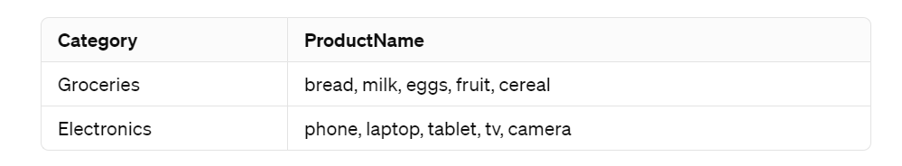

# springboot-retail-product-discount-app 

### Problem Statement 
On a retail website, the following discounts apply:
1.	If the user is an employee of the store, he gets a 30% discount
2.	If the user is an affiliate of the store, he gets a 10% discount
3.	If the user has been a customer for over 2 years, he gets a 5% discount.
4.	For every $100 on the bill, there would be a $ 5 discount (e.g. for $ 990, you get $ 45 as a discount).
5.	The percentage based discounts do not apply on groceries.
6.	A user can get only one of the percentage based discounts on a bill.

### Solution
This application expore a rest endpoint which takes userId and the list of orders in the request body and return the response to the user.
```JSON
{
    "userId": "Deb123",
    "orders": [
        {
        "name": "tablet",
        "price": 150,
        "quantity": 5
        },
         {
        "name": "milk",
        "price": 100,
        "quantity": 5
        }
    ]
}
```
### Class Diagram


### Additional features 

User input validation 
Error handling and displaying proper error messgae
Swagger UI

### Assumptions 

A dataset has been created for user data and another set of product list which is mapped to productType. Please find the datasets below




### Build the project
mvn clean package

### Run unit tests
mvn test

### Generate code coverage report
mvn jacoco:report
Reports will be generated \retail-discount-app\retail-discount-app\target\site\jacoco\index.html

### Run the project
mvn spring-boot:run

### Using the API
Once the project is running, you can hit the POST endpoint http://localhost:8080/api/v1/calculateDiscount with the following request body:
```JSON
{
    "userId": "Deb123",
    "orders": [
        {
        "name": "tablet",
        "price": 150,
        "quantity": 5
        },
         {
        "name": "milk",
        "price": 100,
        "quantity": 5
        }
    ]
}
```

### Find the swagger UI -
http://localhost:8080/swagger-ui/index.html

### Static code analysis with Sonarlint


### Code coverage with Jacoco

